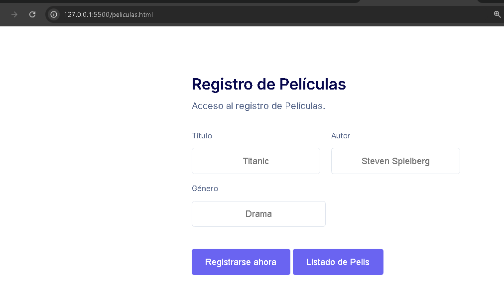
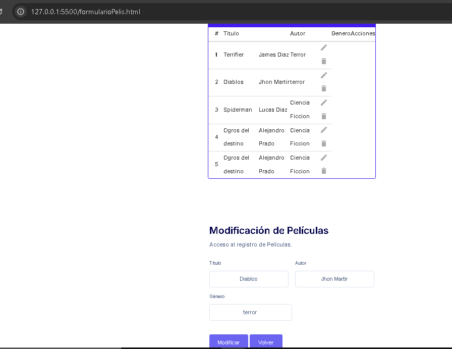

# Getting Started
Tenemos un proyecto de VideoClup, de registrar Peliculas.

En Front tenemos un proyecto videoclubFront, con el lenguaje Html, CSS y Javascript.
Alta de registro:
Url: http://127.0.0.1:5500/peliculas.html

Listado de peliculas :
UrlFormulario: http://127.0.0.1:5500/formularioPelis.html

### Reference Documentation 

Pruebas nuevas

http://localhost:8090/api/crearPeliculas

http://localhost:8090/api/peliculas